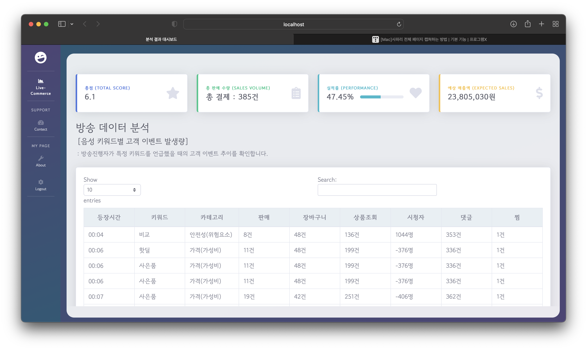
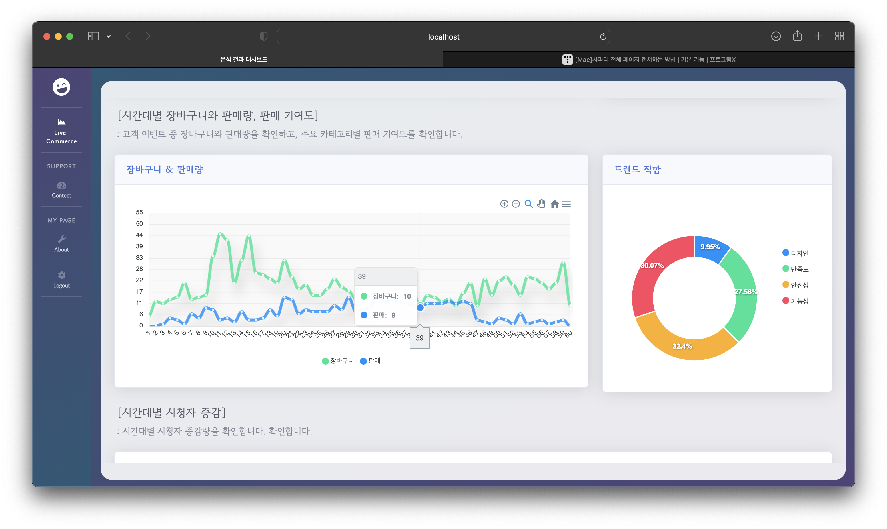
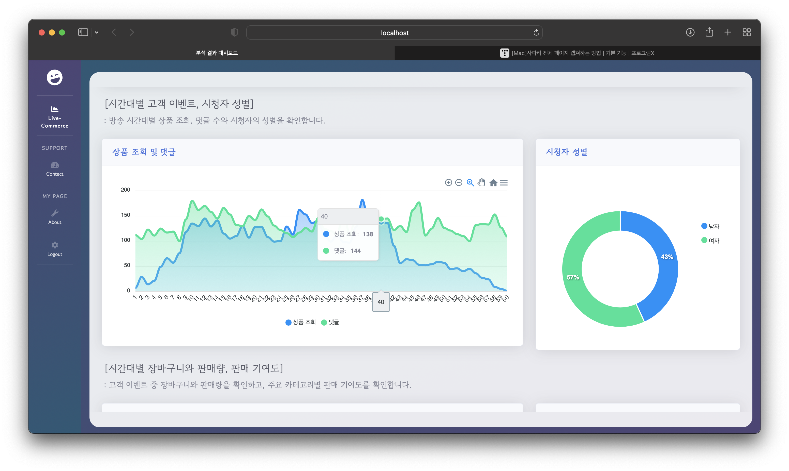
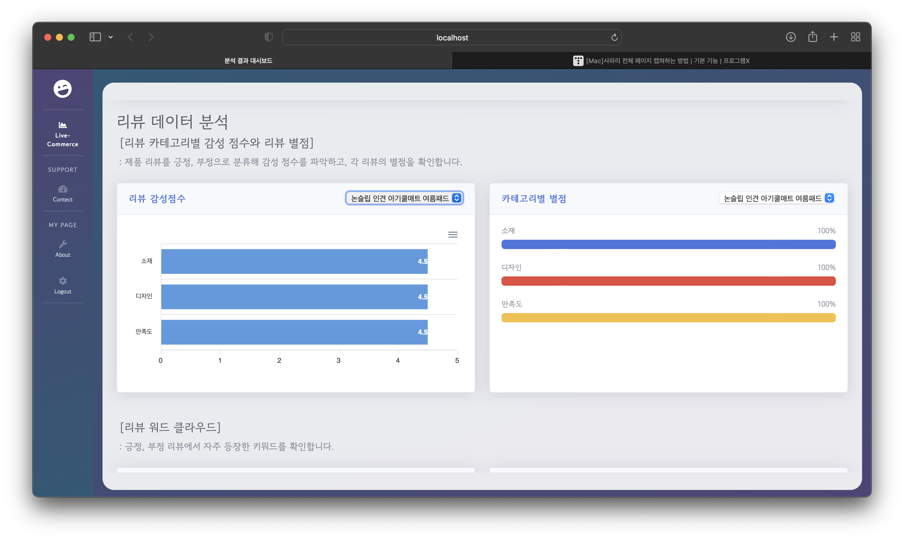
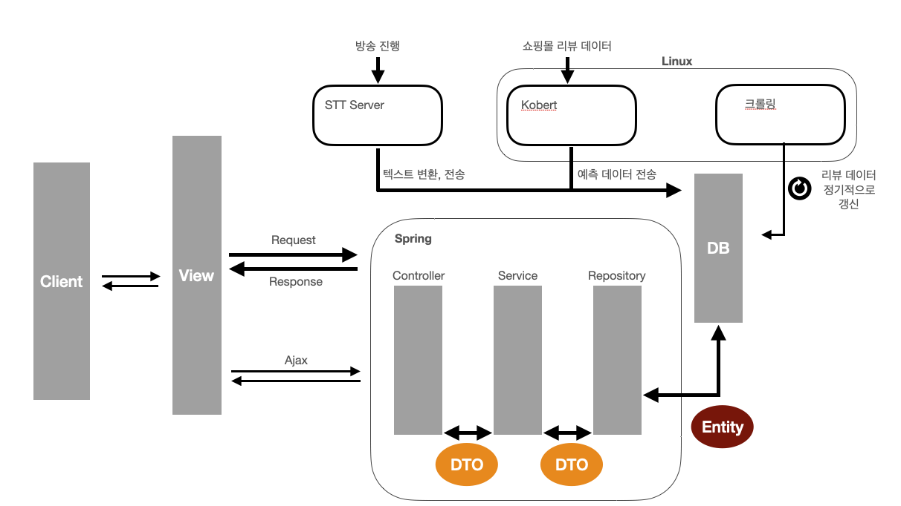
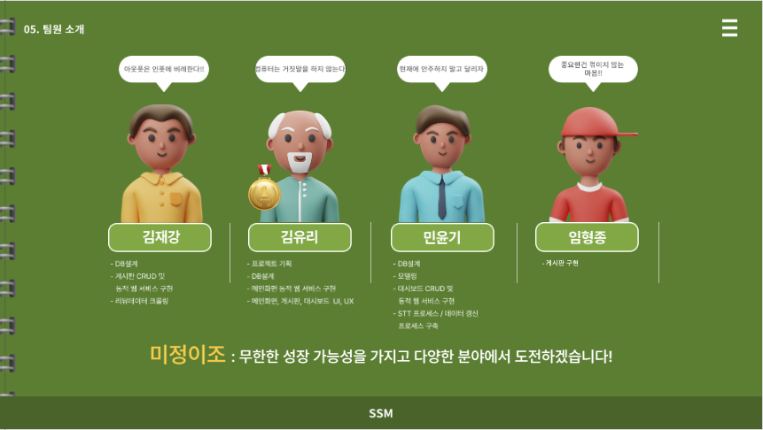

# 💲Smart Sales Manager, SSM💲

(팀명 : 미정이)

# 👀 프로젝트 소개

### 1. 프로젝트명 : 최근 MZ세대를 중심으로 유행중인 무지출챌린지 통합 지원 웹사이트 구현

### 2. 개발배경

- 코로나19 이후 라이브커머스 시장이 새로운 비대면 소비 트렌드로 자리 잡았다.
- 소비자와 실시간으로 상호작용하는 라이브커머스 시장이 급성장했다.
- 라이브커머스 시장 규모는 2020년 4,000억 원, 2021년 2조 8,000억 원, 2023년에는 10조 원까지 성장할 것으로 전망한다.
- 새로운 소비 트렌드를 중심으로 소비자 니즈의 실시간 대응이 필요하다.

### 3. 개발의 필요성

- 소비자 니즈(needs) 파악
: 라이브커머스 상품 리뷰, 소비자 댓글 및 구매와 같은 데이터 분석으로소비자 니즈에 대해 파악하고 그에 대응하는 마케팅 전략 수립이 필요하다.
- 제품 맞춤형 솔루션 제공
: 구매자가 우리 제품을 볼 때 주로 어떤 점을 중요시하는지 주요 키워드를 파악하고 고객 감성에 대한 이해가 필요하다.

### 4. 개발목표

1. 판매자 멘트를 통한 고객 구매 추이 확인
- STT Open API를 통해 판매자의 방송 멘트를 인식하여 텍스트로 추출한다.
- Konlpy 등 다양한 형태소 분석기를 통해 텍스트 데이터에서 유의미한 키워드를 도출한다.
- 멘트 별 판매 기여도 점수를 계산한다.
- 해당 키워드를 언급했을 때 고객 로그데이터(장바구니 추가 수, 판매량) 변화량을 확인한다.

2. 리뷰데이터 기반 주요 키워드의 감성분석

- 전처리과정을 통한 중복데이터 제거 및 한국어 형태소 분석으로 유의미한 키워드를 추출 (Konlpy, Okt, Mecab 등) 한다.
- 리뷰를 문장 단위로 토큰화하여 주제 분류 후에 각 주제에 대한 긍,부정 점수를 도출한다.
- 시각화 및 워드 클라우드를 통해 자주 등장하는 키워드를 명시한다.

# 🗓️ 프로젝트 기간

2022.11.16 ~ 2022.12.15 (약4주)

# ✨ 주요 기능 및 화면 구성

## 1. 대시보드

해당 방송의 종합적인 분석 내용을 확인할 수 있다. 새창으로 뜨기 때문에 여러 방송의 대시보드들을 띄워 비교하며 확인할 수 있다.

- 전체 요약 테이블
    
    : 총점, 총 판매 수량, 실적률, 예상 매출액을 포함한 전체 요약 데이터가 상단에 있다.
    
- 방송데이터 분석 테이블
    
    : 방송 음성 데이터에서 주목해야할 키워드들을 추출하고 나온 시간대별 +3~5분 사이의 시청자 이벤트들을 집계해준다. 검색, 컬럼별 오름차순, 내림차순 정렬이 가능하다.
    

- 시간대별 장바구니와 판매량
    
    : 시간대별 장바구니와 판매량 그래프, 마우스 포인터를 올리면 해당 시간의 수치값들을 확인할 수 있다. 또한, 특정 시간대를 드래그하여 줌인, 줌아웃도 가능하다.
    
- 판매 기여도
    
    : 주목해야할 키워드 주제별로 판매에 관여한 정도를 도넛차트로 제공한다.
    
    
    
- 시간대별 고객 이벤트
    
    : 방송 조회 및 댓글 수 그래프, 마우스 포인터를 올리면 해당 시간의 수치값들을 확인할 수 있다. 또한, 특정 시간대를 드래그하여 줌인, 줌아웃도 가능하다.
    
- 시청자 성별 파이차트

- 시간대별 시청자 증감
    
    : 방송 전체 시간대의 시청자 증감량을 보여주는 막대그래프를 제공한다. 줌인, 줌아웃 기능을 제공한다.
    
    
    
- 리뷰 데이터 감성 분석

: 해당 방송에서 판매하는 제품별로 리뷰 감성 점수(0 ~ 5점)를 제공한다. 해당 제품의 리뷰에서 등장한 주요 키워드 주제별로 감성 점수를 제공한다. select 박스를 통해 제품별로 확인이 가능하다.

- 리뷰 데이터 별점 분석

: 해당 방송에서 판매하는 제품별로 리뷰 별점 점수(0 ~ 5점)를 제공한다. 해당 제품의 리뷰에서 등장한 주요 키워드 주제별로 별점 점수를 제공한다. select 박스를 통해 제품별로 확인이 가능하다.

- 리뷰 워드 클라우드

: 긍정, 부정 리뷰별로 자주 등장하는 단어들을 워드 클라우드로 제공한다.

- 분석 결과
    
    : 방송과 판매에 대한 종합적인 결과를 텍스트 형태로 제공한다.
    
- 보고서 기능
    
    : 해당 대시보드의 데이터를 엑셀과 PDF 형식으로 받을 수 있다.
    

## 2. 방송 리스트 화면

등록된 방송들의 리스트를 확인할 수 있다. 상세보기를 누르면 해당 방송에 대한 분석 대시보드로 이동할 수 있다.

## 3. 게시판 기능

게시판을 통해 관리자에게 문의 및 답변을 받을 수 있고, 관리자는 해당 게시물을 처리(반려, 승인)를 할 수 있다.

## 딥러닝 기술

- STT

- KoBERT
    
    
    
    
    

# 💻 서비스 아키텍처

# 💪🏻 기술스택

- 협업 도구 : Git, Notion
- 개발 도구
    
    
    

# 👨‍👩‍👦‍👦 팀원 역할

